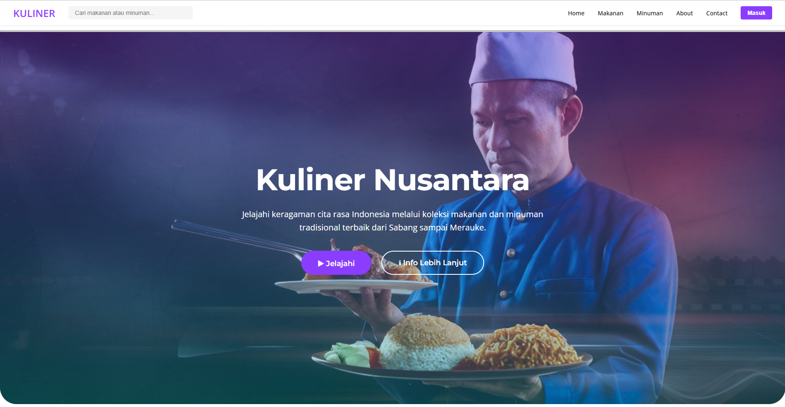
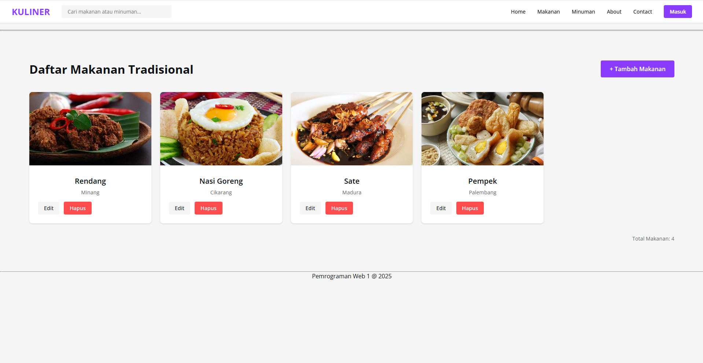
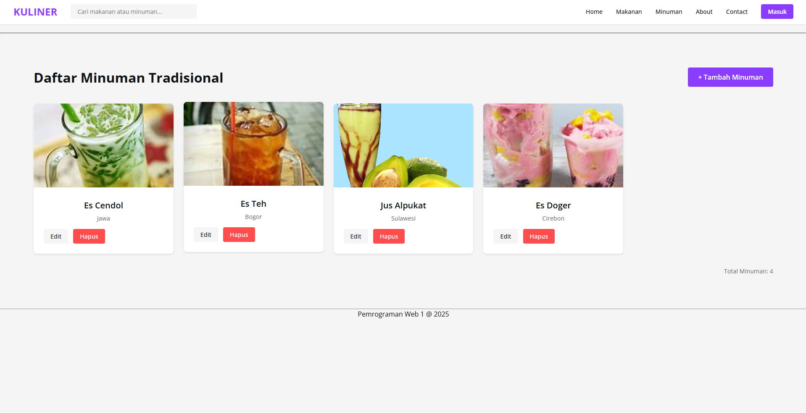
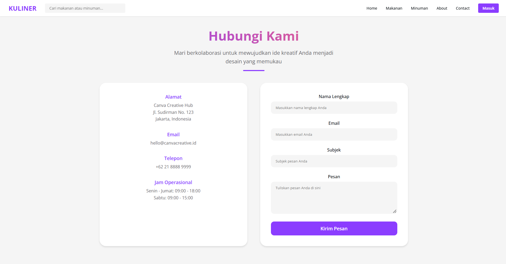

# 🍱 Kuliner Nusantara Website

## 👤 Profil Pengembang
| Atribut | Keterangan |
|---------|------------|
| Nama | Faiz Maulana |
| NIM | 312310469 |
| Kelas | TI.23.A.5 |
| Mata Kuliah | Pemrograman Website |

## 📝 Deskripsi Project
Project website Kuliner Nusantara merupakan implementasi dari mata kuliah Pemrograman Web 1. Website ini dirancang untuk mendokumentasikan dan memperkenalkan kekayaan kuliner tradisional Indonesia dengan tampilan modern yang terinspirasi dari Spotify. Dibangun menggunakan HTML, CSS, JavaScript, PHP, dan MySQL.

## 🖥️ Tampilan Website

### 1. Landing Page

- **Navbar**
  - Logo "KULINER" di pojok kiri
  - Search bar dengan placeholder "Cari makanan atau minuman..."
  - Menu navigasi: Home, Makanan, Minuman, About, Contact
  - Tombol "Masuk" dengan warna ungu khas
- **Hero Section**
  - Heading utama "Kuliner Nusantara"
  - Tagline menarik tentang cita rasa autentik Indonesia
  - Background image chef dengan overlay gradien
  - Dua CTA button: "Jelajahi" dan "Info Lebih Lanjut"

### 2. Halaman Makanan Tradisional

- **Header**
  - Judul "Daftar Makanan Tradisional"
  - Tombol "+ Tambah Makanan" di pojok kanan
- **Grid Makanan**
  - Card makanan dengan layout 4 kolom
  - Setiap card menampilkan:
    - Foto makanan dengan aspect ratio 1:1
    - Nama makanan (contoh: Rendang, Nasi Goreng, Sate, Pempek)
    - Asal daerah (contoh: Minang, Cikarang, Madura, Palembang)
    - Tombol aksi: Edit dan Hapus
  - Total item ditampilkan di footer

### 3. Halaman Minuman Tradisional

- Layout serupa dengan halaman makanan
- Menampilkan minuman tradisional seperti:
  - Es Cendol (Jawa)
  - Es Teh (Bogor)
  - Jus Alpukat (Sulawesi)
  - Es Doger (Cirebon)

### 4. Form Management
#### Form Tambah Makanan/Minuman

- Form input dengan fields:
  - Nama Makanan/Minuman
  - Daerah Asal
- Tombol aksi:
  - "Simpan" (ungu)
  - "Batal" (abu-abu)

#### Form Edit

- Pre-filled form dengan data existing
- Fields sama dengan form tambah
- Tombol "Update" untuk menyimpan perubahan

### 5. Halaman About
- **Kreasi Tanpa Batas** section
  - Tagline tentang kreativitas
  - 3 fitur utama:
    1. Desain Intuitif
    2. Inspirasi Tanpa Batas
    3. Kolaborasi Real-time
  - Statistik website:
    - 100M+ Pengguna Aktif
    - 500K+ Template
    - 190+ Negara
    - 1B+ Desain Dibuat

### 6. Halaman Contact

- Form kontak dengan fields:
  - Nama Lengkap
  - Email
  - Subjek
  - Pesan
- Informasi kontak:
  - Alamat: Jl. Sudirman No. 123, Jakarta
  - Email: hello@canvacreative.id
  - Telepon: +62 21 8888 9999
  - Jam Operasional:
    - Senin-Jumat: 09:00 - 18:00
    - Sabtu: 09:00 - 15:00

## 🛠️ Teknologi yang Digunakan
- HTML5
- CSS3 (Flexbox & Grid)
- JavaScript
- PHP
- MySQL
- Font Awesome (icons)
- Google Fonts (Poppins)

## ✨ Fitur Utama
1. Manajemen data kuliner (CRUD)
2. Responsive design
3. Search functionality
4. Modern UI dengan tema ungu
5. Form validasi
6. Grid layout system
7. Interactive elements (hover effects, transitions)

## 👨‍💻 Pengembang
- **Nama**: Faiz Maulana
- **NIM**: 312310469
- **Kelas**: TI.23.A.5
- **Mata Kuliah**: Pemrograman Web 1
- **Dosen**: Eko Budiarto, S.Kom., M.M.

## 📄 Lisensi
© 2025 Kuliner Nusantara. All rights reserved.